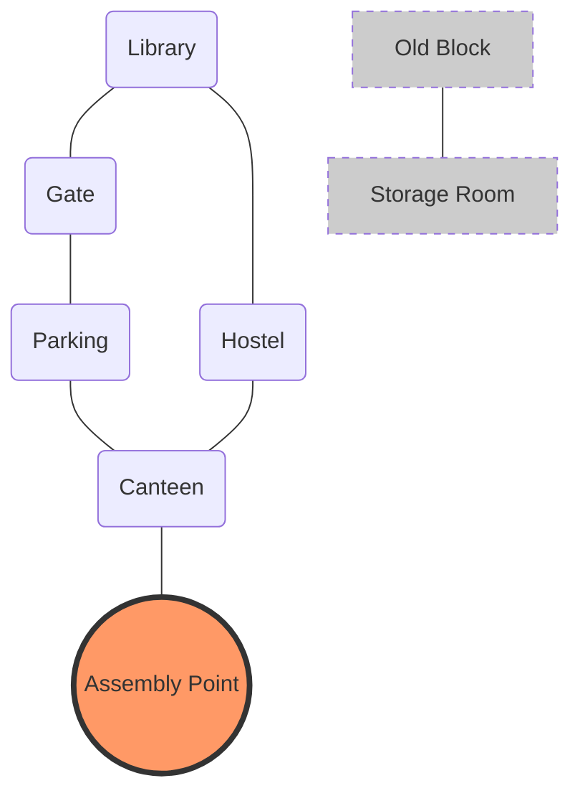
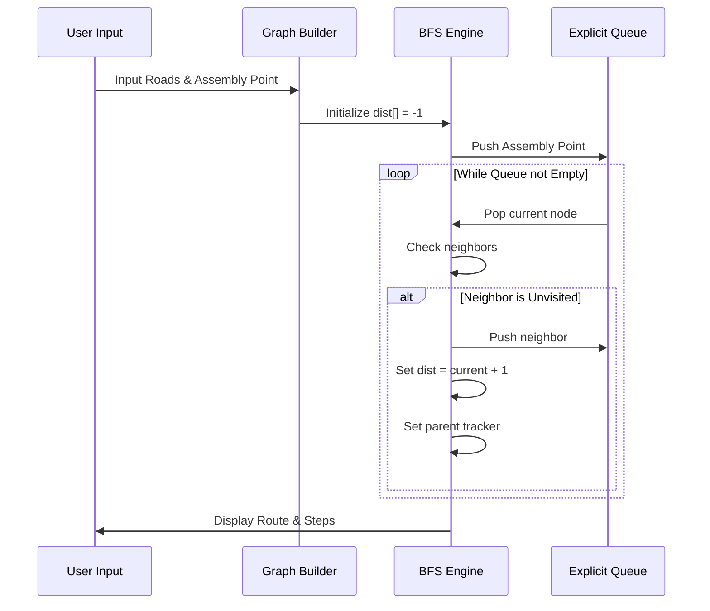

# Campus Emergency Route Finder

[](https://isocpp.org/)
[](https://en.wikipedia.org/wiki/Graph_(abstract_data_type))
[](https://en.wikipedia.org/wiki/Breadth-first_search)

## Overview
In critical emergencies, every second counts. The **Campus Emergency Route Finder** is a graph-based navigation system designed to find the shortest path from any campus location to a designated **Assembly Point**. 

By modeling the campus as an **Unweighted Graph**, the system utilizes the **Breadth-First Search (BFS)** algorithm to guarantee the most efficient evacuation route (minimum steps).

---

## Core Engineering Logic
### Graph Representation
The campus is represented as an **Adjacency List** using `std::map<string, vector<string>>`. This allows us to handle named locations (strings) efficiently without needing to map them to integer IDs manually.

### Why Breadth-First Search (BFS)?
For this project, BFS is the mathematically optimal choice because:
1. **Shortest Path Guarantee:** In unweighted graphs, BFS always finds the shortest path in terms of edges.
2. **Completeness:** It explores all reachable nodes systematically.
3. **Complexity:** Operates in $O(V + E)$ time, ensuring real-time performance.

---

## Visual System Architecture
Using the sample input, here is how the system visualizes the campus network and the evacuation flow:



---

## Algorithm Workflow (BFS)
The following sequence diagram illustrates how the system processes an emergency request:



---

## How to Use
1. **Input Format:**
   - Line 1: `n` (points), `m` (edges).
   - Next `m` lines: `PointA PointB` (road connection).
   - Final line: `AssemblyPointName`.

2. **Sample Input:**
   ```text
   7 6
   Library Gate
   Library Hostel
   Hostel Canteen
   Gate Parking
   Parking Canteen
   Canteen AssemblyPoint
   OldBlock StorageRoom
   AssemblyPoint
   ```

3. **Compilation:**
   ```bash
   g++ -std=c++11 main.cpp -o emergency_finder
   ./emergency_finder
   ```

---

## Features & Edge Case Handling
- **Explicit Queue Implementation:** Built from scratch using templates (no `std::queue` used) to meet academic requirements.
- **Unreachable Point Detection:** Locations like `OldBlock` are identified as `Reachable: No`.
- **Dynamic Routing:** Backtracks from the destination using a `parent map` to reconstruct the exact path.

---

## Complexity Analysis
| Metric | Complexity | Description |
| :--- | :--- | :--- |
| **Time Complexity** | $O(V + E)$ | Every vertex and edge is processed once. |
| **Space Complexity** | $O(V)$ | Memory used by adjacency list and tracking maps. |

---

## Academic Credits
- **Course:** CSE207 Data Structures  
- **Instructor:** Puja Chakraborty  
- **Developed by:** [Arup Bhowmik Pritom] (ID: [2025-2-60-330])  
- **Institution:** East West University  

---
*This project is part of the CSE207 Summer 2026 Lab Performance Evaluation.*
